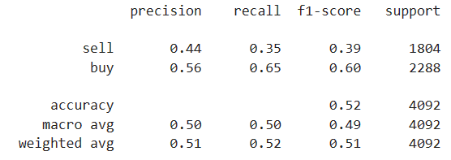

# Machine Learning Trading Bot

The exericse seeks to improve the existing algorithmic trading systems by enhancing the trading signals with machine learning algorithms that can adapt to new data. The improved algorithm will enhance the speed and the ability to automatically trade assets in a highly dynamic environment. 

The report has been structured as follows:
* **The Baseline** includes the existing trading algorithm and the signal used. 
* **Tune the Baseline** discusses two enhancements considered: adjusting the size of the training dataset (and hence testing dataset), and adjusting the Simple Moving Averages (SMAs) input features. 
* **New Machine Learning Classifier** outlines an alternate machine learning model using a new classifier, the random forest classifier.

 To evaluate the merits of each adjustment, we compare the cumulative products of the strategy returns on an MSCI-based emerging markets ETF over the investment window starting from Jan 2015 to Jan 2021.

### The Baseline
The current trading algorithm is built on a support vector classifier (SVC) learning model using trading signals predicted from two SMAs: 4 consecutive prices short window SMAs and 100 consecutive prices long window SMAs. SVC learning model is fitted with 3-month training data. 

The performance of the current model are as follows:  

* The baseline model has an overall accuracy score of 55%. 
* The prediction on sell signal is poor given a precision score of 43% and recall score of 4%. 
* The prediction on buy signal is average with an precision score of 56% and recall score of 96%.
* The cumulative return up to 22 Jan 2022 is **62%**. 

The graph below shows the actual returns and strategy returns.

### Tune the Baseline
**1. Adjusting the size of the training dataset**  
Using different size of training dataset could affect how well and effective the SVC model learns. The graph below shows the cumulative return using various sizes of training dataset.  

The default size of the training dataset is 3 months. Decreasing the training window does not improve the result. There are a few challenges arising from small training window:  
* Training dataset may capture only one class of signal. Having single class of signal in the training dataset makes it impossible to train any machine learning model.
* Small training dataset may capture significant one-off event that could potentially skew the results. 

 Increasing the training window could improve the trading algorithm. Based on the data used, 7 months training dataset generated the highest cumulative return. 

**2. Adjusting the Simple Moving Averages (SMA) input features**  
The baseline model uses two SMAs: 4 prices short window SMAs and 100 long window prices SMAs. The table below shows the strategy returns using different pairs of short window and long window SMAs.  

  
 Note: Red box = baseline performance 

Using the default size of training dataset, increasing and/or decreasing the SMA input features does not necessarily improve the strategy returns.

**3. The Best Improved Trading Algorithm** 
The table below gives the three sets of parameters that generate the top three highest strategy return using the SVC model.  
  

The set parameter that best improved the return is:
* size of training dataset = 4 months
* short window SMAs = 80 prices
* long window SMAs = 200 prices

The performance of this improved model is as follows:  

* The improved model has an overall accurary score of 54% (similar to the baseline).
* The prediction on sell signal has a slightly higher precision but a significantly improved recall as compared to the baseline.
* The prediction on buy signal is reasonably acceptable with a precision score of 57% and recall score of 73%. 
* The cumulative strategy return is improved by 55% as compared to the baseline.

### New Machine Learning Classifier
A second machine learning model which is built on random forest classifer is considered. Using the same set of parameters as per the baseline model, the performance of the random forest classifier model is as follows:  

* The new model has an overall accurary score of 52% (lower than the baseline).
* The prediction on sell signal is better with a slightly higher precision score and a significantly improved recall score as compared to the baseline.
* The prediction on buy signal is reasonably acceptable with a precision score of 56% and recall score of 65%. 
* New model generated 2% lower cumulative return than the baseline for the same investment window up to 22/01/2022. The new model performed worse than the baseline model.
* New model generated 58% lower return than the tuned trading algorithm for the same investment window up to 22/01/2022. The new model performed worse than the tuned trading algorithm.

The graph below compares the cumulative return from the machine learning model using random forest classifer to the baseline. 

### Overall results
The tuned trading algorithm based on a SVC learning model using 4 months training dataset, 80 prices short window SMAs and 200 prices long window SMAs gives the highest cumulative return for the investment window from 2015 up to 22 Jan 2022.

 
### Conclusion
All models considered have low accuracy score and no better than random guesses. To improve the accuracy of the models, one may consider increasing the number of features used to predict the trading signals.

The tuned trading algorithm based on a SVC learning model using 4 months training dataset, 80 prices short window SMAs and 200 prices long window SMAs is preferred until the next improved model is identified. 

