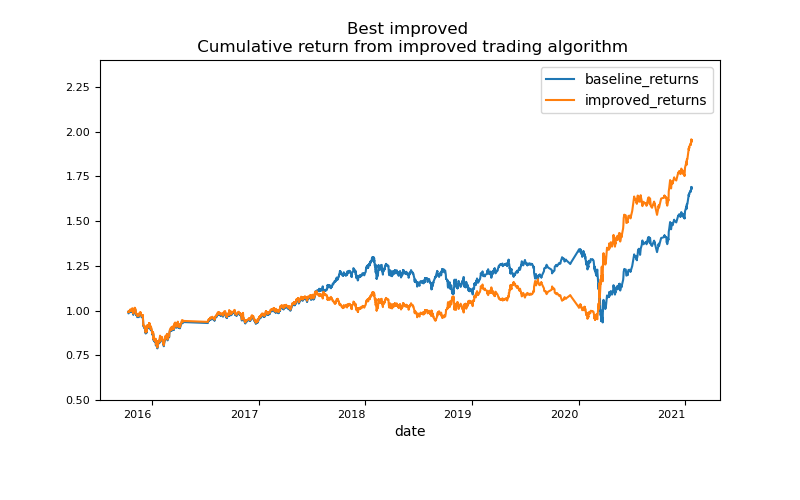

# Machine Learning Trading Bot

The exericse seeks to improve the existing algorithmic trading systems by enhancing the trading signals with machine learning algorithms that can adapt to new data. This improved algorithms will enhance the speed and our ability to automatically trade assets in a highly dynamic environment and give us a competitve advantage early on. 

### Current algorithm trading system

### Optimising the trading algorithm

### A new machine learning model

### Recommendation