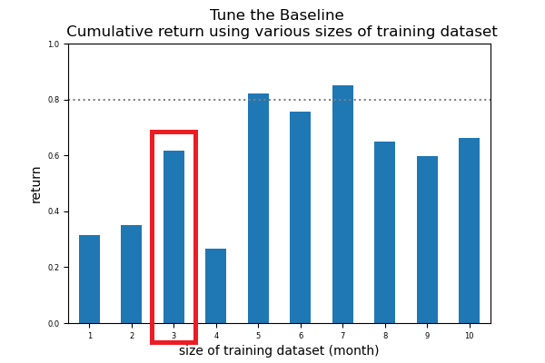
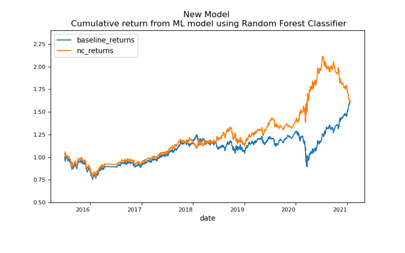
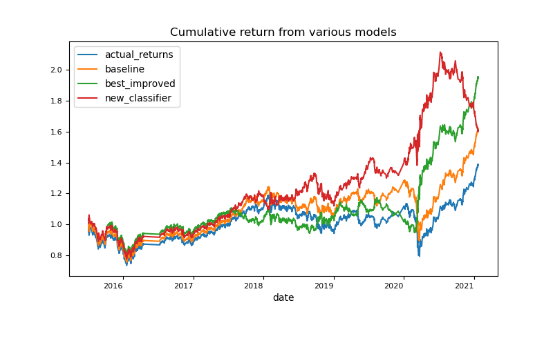

# Machine Learning Trading Bot

The exericse seeks to improve the existing algorithmic trading systems by enhancing the trading signals with machine learning algorithms that can adapt to new data. The improved algorithm will enhance the speed and our ability to automatically trade assets in a highly dynamic environment and give us a competitve advantage early on. 

This report has been structured as follows:
* **The Baseline** includes the existing trading algorithm as well as the trading signal used. 
* **Tune the Baseline** discusses the two enhancements considered: adjusting the size of the training dataset (and hence testing dataset), and adjusting the Simple Moving Averages (SMAs) input features. 
* **New Machine Learning Classifier.** outlines an alternate machine learning model using a new classifier, i.e. the Voting Classifier.

 To evaluate the merits of each improvement, we compare the cumulative products of the strategy returns on an MSCI-based emerging markets ETF over the investment window starting from Jan 2015 to Jan 2021.

### The Baseline
The current trading algorithm is built on a support vector classifier (SVC) learning model using trading signals predicted based on 4 consecutive prices SMAs and 100 consecutive prices SMAs. SVC learning model is fitted with 3-month training data. 

From a technical perspective, 

* The model has an overall accuracy score of 55% (perform marginally better than random guesses). 
* The prediction on sell signal is poor given a precision score of 43% and recall score of 4%. 
* The prediction on buy signal is slightly better with an precision score of 56% and recall score of 96%.

At 22 Jan 2022, the strategy provided a **62%** cumulative return. The graph below compares the actual returns and strategy returns (generated from the SVC model).

### Tune the Baseline
**1. Adjusting the size of the training dataset**  
Using different size of training dataset could affect how well and effective the SVC model learn. The bar graph below shows the cumulative return using different size of the training dataset.

Baseline size of the training dataset is 3 months. Decreasing the training window does not generate a better result. Increasing the training window could improve the trading algorithm. Based on the sample used, using 7 months data to train the model generated the highest cumulative return. 

**2. Adjusting the Simple Moving Averages (SMA) input features**  
The baseline model uses two sets of features: 4 prices SMAs and 100 prices SMAs. The table below shows the strategy returns using different combination set of short window and long window SMAs.  

  
 Note: Red box = baseline performance 

Using the same dataset including same size of trainind dataset, increasing and/or decreasing the SMA input features does not necessarily improve the strategy returns.

**3. The Best Improved Trading Algorithm** 
The table below summarises the three set of parameters that generate the top three strategy return using the SVC model.  
  

The set parameter that best improved the returns are:
* size of training dataset = 4 months
* short window SMAs = 80 prices
* long window SMAs = 200 prices

From a technical perspective, the performance of this improved model is also preferred.

  
* An overall accurary score of 54% (relatively similar to the baseline)
* The prediction on sell signal has a slightly higher precision score but a significantly improved recall score.
* The prediction on buy signal is reasonably acceptable with a precision score of 57% and recall score of 73%. 

The cumulative strategy returns is improved by 55% as compared to the baseline. 

### New Machine Learning Classifier
In this section, we explore a second machine learning model. 

### Conclusion

